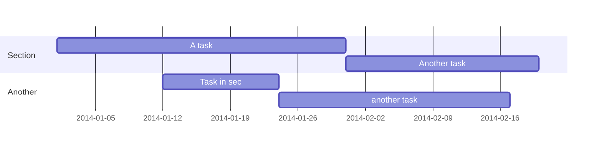

Loreamdfdf dfasfd Loreamdfdf dfasfd Loreamdfdf dfasfd Dictum at tempor commodo ullamcorper a lacus vestibulum sed arcu. Mattis ullamcorper velit sed ullamcorper morbi. Lacus vel facilisis volutpat est velit egestas dui id. Sed viverra ipsum nunc aliquet bibendum enim facilisis.

```python
# Example of code highlighting
input_string_var = input("Enter some data: ")
print("You entered: {}".format(input_string_var))
```




$$\gamma_{n} = \frac{ 
\left | \left (\mathbf x_{n} - \mathbf x_{n-1} \right )^T 
\left [\nabla F (\mathbf x_{n}) - \nabla F (\mathbf x_{n-1}) \right ] \right |}
{\left \|\nabla F(\mathbf{x}_{n}) - \nabla F(\mathbf{x}_{n-1}) \right \|^2}$$

### Lecture Notes
[Lecture1](https://github.com/KateDoan/demo_hugo/raw/master/pdf_demo.pdf)

[Lecture2](https://github.com/KateDoan/demo_hugo/raw/master/pdf_demo.pdf)

### Homework
[Homework1](https://github.com/KateDoan/demo_hugo/raw/master/pdf_demo.pdf)

[Homework2](https://github.com/KateDoan/demo_hugo/raw/master/pdf_demo.pdf)

